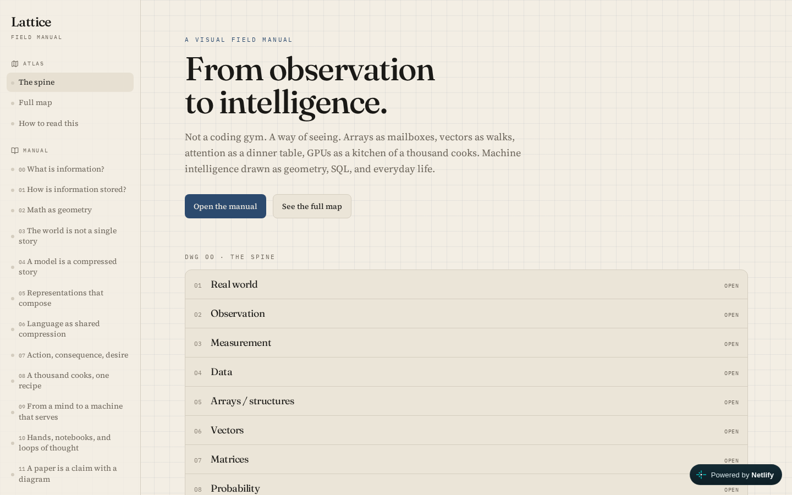

# Lattice

A visual field manual of machine intelligence — from observation and arrays to attention, GPUs, and research papers.

Not a coding gym. A way of seeing. Arrays as mailboxes, vectors as walks, attention as a dinner table, GPUs as a kitchen of a thousand cooks.

**Live:** [lattice-field-manual.netlify.app](https://lattice-field-manual.netlify.app)



```
REAL WORLD → OBSERVATION → MEASUREMENT → DATA
     → ARRAYS → VECTORS → MATRICES
     → PROBABILITY → MODELS → LEARNING
     → HARDWARE → SYSTEMS → AGENTS
```

## Contents

**Manual**

| # | Chapter |
|---|---|
| 00 | What is information? |
| 01 | How is information stored? |
| 02 | Math as geometry |
| 03 | The world is not a single story |
| 04 | A model is a compressed story |
| 05 | Representations that compose |
| 06 | Language as shared compression |
| 07 | Action, consequence, desire |
| 08 | A thousand cooks, one recipe |
| 09 | From a mind to a machine that serves |
| 10 | Hands, notebooks, and loops of thought |
| 11 | A paper is a claim with a diagram |

**Papers** — VGG, ResNet, Word2Vec, LSTM, Transformer, BERT, GPT-2, LLaMA / Qwen, diffusion, AlphaGo.

This is an original companion covering a publicly visible ML curriculum. It does not reproduce anyone’s lesson text, solutions, or product interface.

## Run locally

```bash
npm install
npm run dev
```

```bash
npm run build
npm run typecheck
```

## Related

- [meridian](https://github.com/ahmaddroobi99/meridian) — what to read next
- [qg-lada-lab](https://github.com/ahmaddroobi99/qg-lada-lab) — a scientific model treated as a system, not a metaphor

## License

Original writing and diagrams in this repository are yours to read and share with attribution. Landmark paper titles remain the names of their authors’ work.

---

Account grouping: research first, undergraduate last — see the [profile README](https://github.com/ahmaddroobi99/ahmaddroobi99). GitHub cannot custom-sort the Repositories tab.

